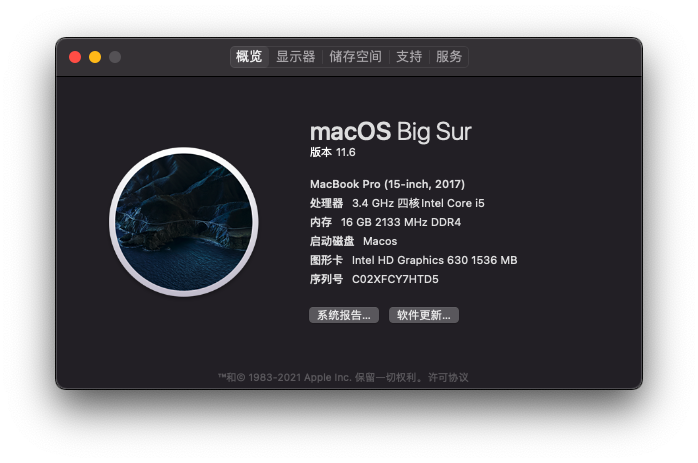
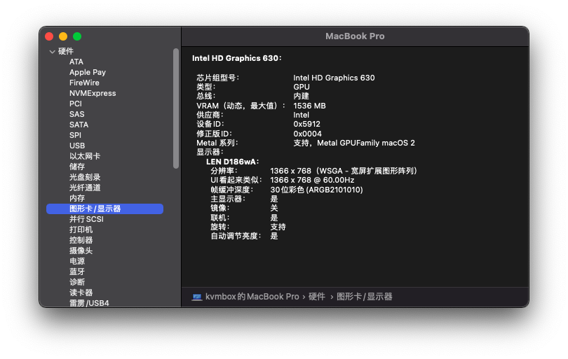

# i5-7500-ASUS-PRIME-B250-PLUS

| CPU | intel i5-7500         |
|:---:|:---------------------:|
| GPU | Intel HD Graphics 630 |
| 内存  | 芝奇DDR4 8G 2133 * 2    |
| 主板  | 华硕PRIME-B250-PLUS     |
| 网卡  | Realtek RTL8111H      |
| 声卡  | Realtek ALC887        |
| 硬盘  | 金泰克 SSD-120G          |

- 安装系统 
  
  macOS Big Sur 11.6

## 功能

声卡、网卡、核显正常驱动，使用网线，就没有测试Wi-Fi
